# Installation
One of the most frequent questions we get asked is "what will the impact on my property be". They say a picture says a thousand words and in keeping with that sentiment, we are collating pictures of customer installs as they progress throughout the villages. 

## Customer testimonial (Grindleton)

We had the B4RN team at ours yesterday to lay the ducting. We are absolutely thrilled with the workmanship and finish. The guys, Cid and Oliver, are lovely, polite, efficient and extremely tidy workers.

The garden dig happened almost as if by magic from the cut in the lawn & flower bed, to lifting & replacing the paving and passing under the fencing into the field. The field dig was not so simple as it is full of very large stones, but they dug by hand, (requiring pick axe and a large disc cutter in places) and replaced the sods with as much care as if it was a prized lawn, even brushing it to finish! As the photos show, you can hardly see where they’ve cut and the grass will knit back together in no time.

So, to reassure anyone who is nervous about the process- it’s painless!

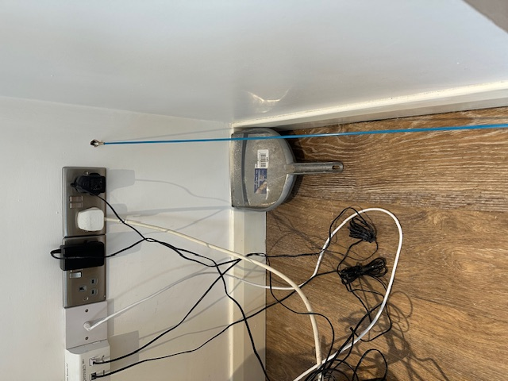{ width="150" }
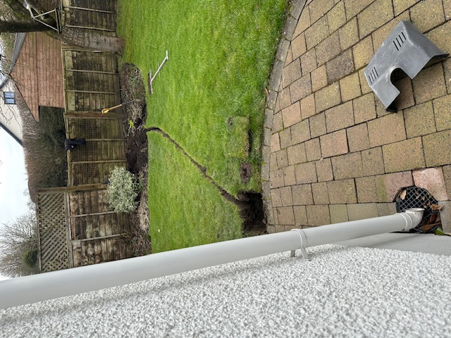{ width="150" }
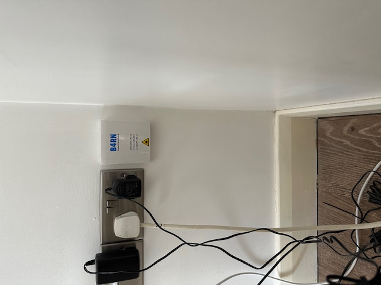{ width="150" }
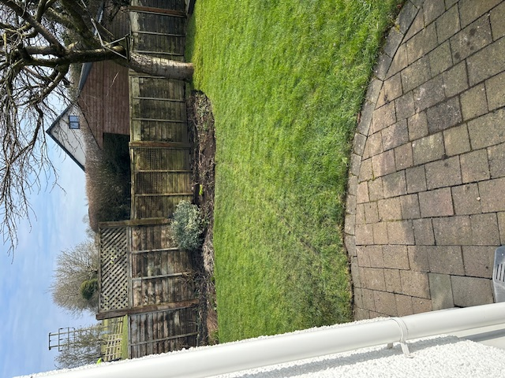{ width="150" }
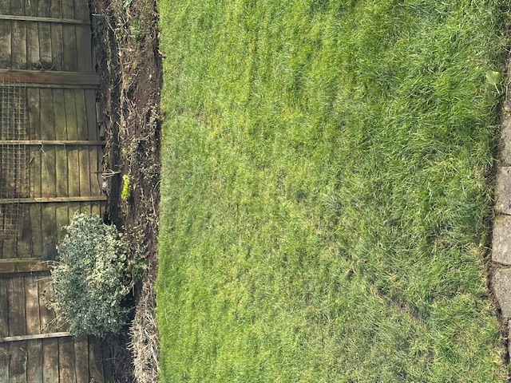{ width="150" }
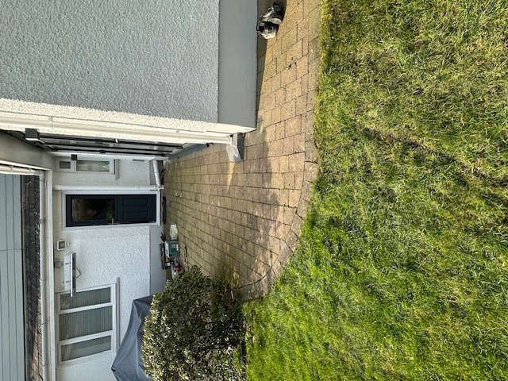{ width="150" }
{ width="150" }
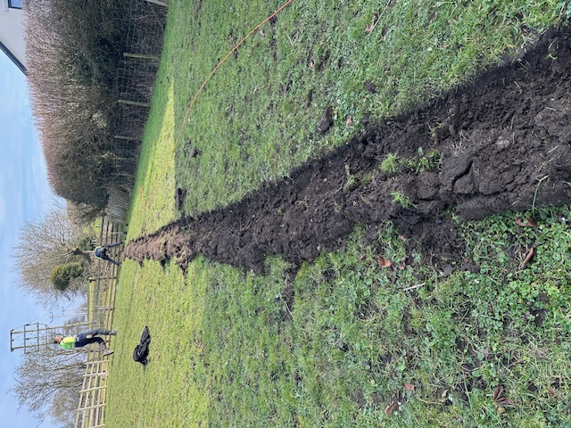{ width="150" }
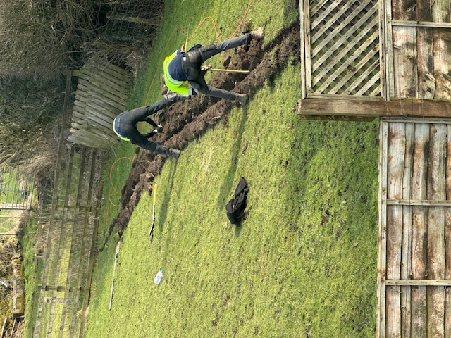{ width="150" }
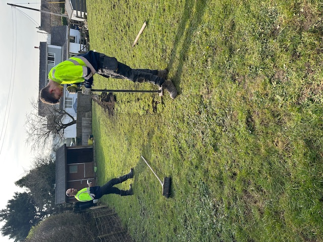{ width="150" }
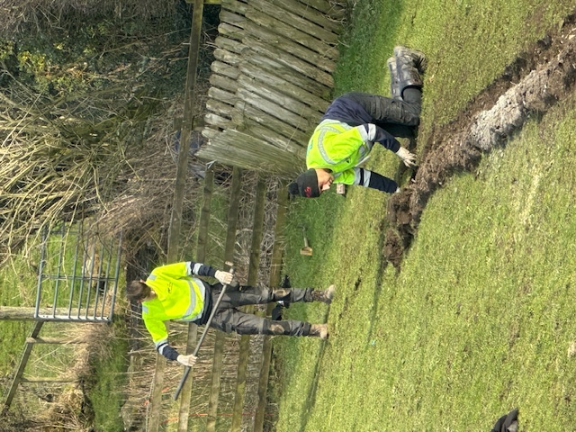{ width="150" }
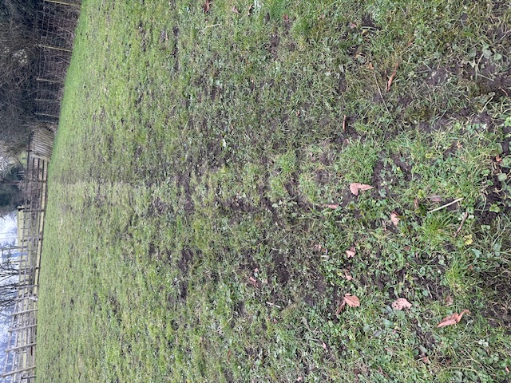{ width="150" }

## Further Reading
Our [FAQ](faq.md) section has more questions about the install, the equipment used and what goes where. If you have any more questions then feel free to [get in touch](contact.md) and we'll do our best to answer.
