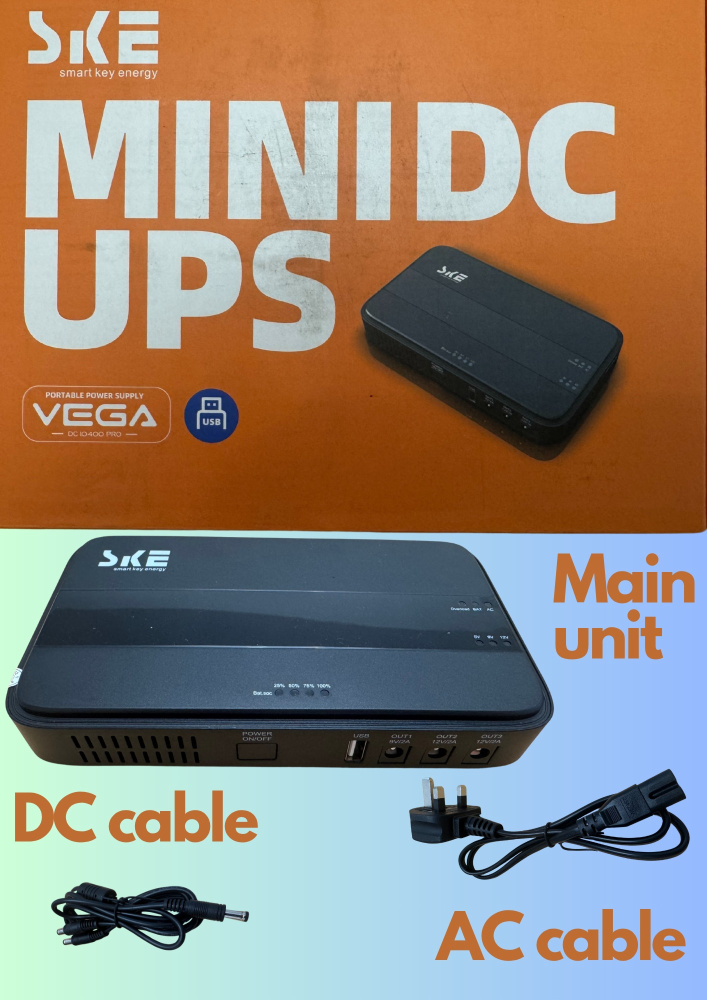

# Installing a UPS

How to keep your B4RN router online in case of a power cut.

A power cut is inconvenient at the best of times, but as more and more services move "online" and telephony moves away from copper to fiber, not losing the internet is often critical. To avoid this, using a battery backup device called a UPS ("Uninterruptable Power Supply") can be purchased separately and installed between the power outlet on the wall and your B4RN router. 

These devices are fairly inexpensive (around £60) and easy to set up, and will offer peace of mind if there happens to be a powercut (and will protect the router in case of short interruptions to the supply which would normally cause the router to reboot).

The below is based on personal experience of one device, others are available (see the table at the bottom of the article) but their operation and how they are set up is almost identical regardless of brand.

### SKE Mini UPS (10400mAh battery, 2x12v outputs, 1x9v output, 1x5v USB-A output)

| Store | Price |
| ----- | ----- |
| [Amazon.co.uk](https://amzn.to/44nNiRZ) | £65.99 * |

* Currently on offer with 35% off making it £42.89

Click on the images below to enlage.

| { width="300" } | { width="300" } |

### Other options (not tested by the author but work the same as the above)

| Item | Store | Price |
| ---- | ----- | ----- |
| APC Back-UPS Connect | [Amazon.co.uk](https://amzn.to/45G9h98) | £59.33 |
| Eaton 3S Mini UPS | [Amazon.co.uk](https://amzn.to/4lgwpiW) | £53.99 |
| Mini UPS Portable | [Amazon.co.uk](https://amzn.to/3T5iTTh) | £38.99 |

Prices and links correct at the time of publishing.